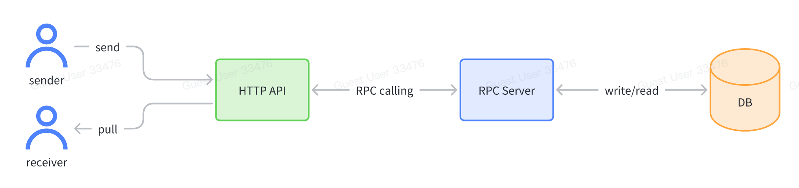

## TikTok Tech Immersion 2023 - Backend

### Assignment Requirements:
Full Assigment Description can be found at: https://bytedance.sg.feishu.cn/docx/P9kQdDkh5oqG37xVm5slN1Mrgle <br>

<p align="center">
    
</p>

<u>Overview:</u> <br>
In this assignment, you will design and develop an IM system implementing a set of specific APIs using Golang. You need only develop the backend side of the system, focusing on core message features without the front-end part and the account/authentication part.

<u>Requirements: </u> <br>
1. Architecture: The system should contain two services: one HTTP server and one RPC server. The IDL of HTTP API is provided below. The RPC IDL is not restricted, but you can also get an example from the demo repository.
2. Data storage: The system should store messages data. Receivers can access this data at any time. At least one database must be used (MySQL or Redis are recommended). There is no limitation on data schema design.
3. Message delivery: The system should be able to deliver messages to the intended recipients by PULL mode in a timely and consistent manner. Pull mode means there is no need to maintain the connection and push new messages to receivers in real-time. Only the pull API must be implemented, so the receiver can use pull API to fetch messages.
4. Performance and scalability: The system should be designed to handle a relatively large number of users and messages. (Support more than 20 concurrency in testing)
5. Bonus point: 
  - Backend services can be deployed elastically.
  - Pass stress testing.


<br>

### Repo Structure
```
.
├── .github
│   └── workflows
│       └── test.yml
├── README.md
├── docker-compose.yml
├── http-server/
├── idl_http.proto
├── idl_rpc.thrift
└── rpc-server/ 

```
- As seen from the Docker-Compose file, this project uses a microservices architecture
- There are 4 containers in this project: redis, etcd, http-server, rpc-server
- The http-server, rpc-server and redis containers communicate by virtue of the Docker Networks and the embedded DNS server. 
- Hence, the containers can communicate with each other by networking with their service name, which acts like the domain name, instead of having to find out what is the IP address for each container.


### Acknowledgements
This repo is largely based on this [repo](https://github.com/weixingp/tiktok-tech-immersion-2023) and [guide](https://o386706e92.larksuite.com/docx/QE9qdhCmsoiieAx6gWEuRxvWsRc), which was kindly provided to help us out with this assignment.
